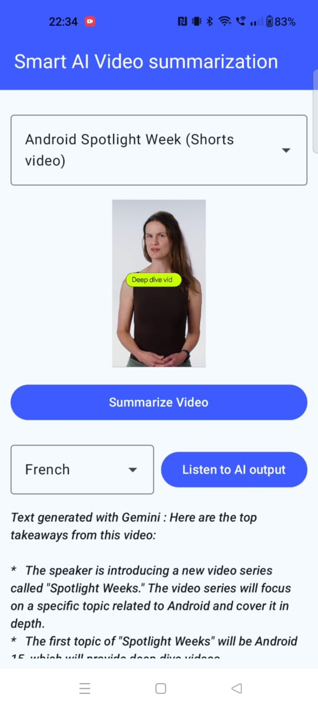
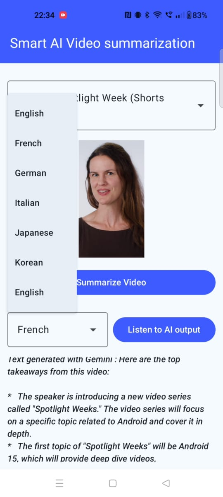

# SmartMediaAI – Video Summarizer App using Firebase Gemini + Jetpack Compose

SmartMediaAI is an Android app that lets users select a video, summarize it using Gemini via Firebase,
and listen to the summary using Text-to-Speech. Works with YouTube links and direct video URLs.


##  Features

- **In-App Video Player**: Built-in player using Jetpack Media3 (ExoPlayer) to handle YouTube and direct video links.
- **AI-Powered Summaries**: Generates smart summaries of video content using the Firebase Gemini API.
- **Text-to-Speech Playback**: Listen to the generated summaries with controls for different accents.
- **Modern UI**: A clean, responsive interface built entirely with Jetpack Compose.
- **Predefined Video List**: A dropdown menu to easily select from a list of sample videos.

## Project Structure

Here is an overview of the key files and directories in the project:

```bash
com.anandgaur.smartmediaai  
├── MainActivity.kt                          # Entry point of the app  
├── player/                                  # Video playback components  
│   ├── VideoPlayer.kt                       # Jetpack Compose-based video player  
│   └── VideoSelectionDropdown.kt            # UI for selecting videos  
├── screen/  
│   └── VideoSummarizationScreen.kt          # Main UI screen for summarization  
├── ui/                                      # UI components for output  
│   ├── TextToSpeechControls.kt              # Controls for TTS playback  
│   └── OutputTextDisplay.kt                 # Displays the summarized output  
├── util/                                    # Utility classes and helpers  
│   └── VideoItem.kt                         # Data model for video entries  
├── viewmodel/                               # ViewModel and state management  
│   ├── VideoSummarizationViewModel.kt       # Handles UI logic and API interactions  
│   └── OutputTextState.kt                   # UI state model for summarized output  
└── SmartMediaAIApplication.kt               # Application class for global setup
```

## Code Overview

This project is follows the **MVVM (Model-View-ViewModel)** architecture for a clean separation of concerns and Jetpack libraries for best practices. Here's a breakdown of how the app works, file by file.

### 1. The Starting Points
*   **`SmartMediaAIApplication.kt`**
    *   **What it is:** The very first code that runs when the app is launched, even before any screen appears.
    *   **What it does:** Performs one-time setups for the entire application, initializing **Firebase** and setting up **Hilt** for dependency management.

*   **`MainActivity.kt`**
    *   **What it is:** The main "window" or entry point for the user interface.
    *   **What it does:** Its only responsibility is to load the overall theme and display our main screen, `VideoSummarizationScreen`.

### 2. The Main Screen: `VideoSummarizationScreen.kt`
*   **What it is:** The heart of our user interface, where the user interacts with the app.
*   **What it does:** It acts as a manager for all visual components.
    *   **Assembles the UI:** Brings together the video player, dropdown menu, "Summarize" button, and the text area for the output.
    *   **Manages State:** Keeps track of important information, like which video is currently selected.
    *   **Handles Video Players:** Decides which video player to show. It uses a special YouTube player for YouTube links and our custom `VideoPlayer` for other links (like `.mp4` files).
    *   **Connects to the "Brain":** Tells the `ViewModel` to start working when the user clicks the "Summarize" button.
    *   **Manages Text-to-Speech:** Initializes and controls the Android Text-to-Speech engine.

### 3. The "Brain" of the App: The ViewModel
*   **`VideoSummarizationViewModel.kt`**
    *   **What it is:** The "brain" of our app. It handles all logic and heavy lifting behind the scenes, separate from the UI.
    *   **What it does:** Takes the video link, creates a request for the **Firebase Gemini AI**, and sends it to Google's servers. As it gets a response, it updates its status, which the UI automatically reflects.

*   **`OutputTextState.kt`**
    *   **What it is:** A simple file that defines the possible states of our summarization process (`Initial`, `Loading`, `Success`, `Error`).
    *   **What it does:** It tells the UI what's happening, allowing it to intelligently show a loading spinner, an error message, or the final summary.

### 4. The Reusable UI Components
*   **`VideoPlayer.kt`** (in the `player` package)
    *   **What it is:** Our custom video player for standard video files (not YouTube).
    *   **What it does:** Uses Google's powerful `ExoPlayer` to play videos and automatically shows a loading spinner when buffering.

*   **`VideoSelectionDropdown.kt`** (in the `player` package)
    *   **What it is:** The dropdown menu that lets the user pick a video.
    *   **What it does:** Displays a list of our sample videos and informs the main screen of the user's choice.

*   **`OutputTextDisplay.kt`** (in the `ui` package)
    *   **What it is:** The text box at the bottom that shows the summary.
    *   **What it does:** Displays text based on the `OutputTextState` from the ViewModel. The success text is scrollable.

*   **`TextToSpeechControls.kt`** (in the `ui` package)
    *   **What it is:** The UI for the "Listen" feature.
    *   **What it does:** Provides the "Listen" / "Pause" button and the accent selection dropdown.

### 5. The Helpers and Data: The `util` package
*   **`VideoItem.kt` & `SampleVideoList.kt`**
    *   **What they are:** A data blueprint for a video and a predefined list of sample videos for the dropdown menu.

*   **`extractYouTubeVideoId.kt`**
    *   **What it is:** A specialized helper function.
    *   **What it does:** Its only job is to take a full YouTube URL and pull out the unique 11-character video ID needed by the player.

## Tech Stack

<table>
    <tr>
        <td><b>Architecture</b></td>
        <td>MVVM Architecture</td>
    </tr>
    <tr>
        <td><b>Language</b></td>
        <td>Kotlin</td>
    </tr>
    <tr>
        <td><b>UI</b></td>
        <td>Jetpack Compose</td>
    </tr>
    <tr>
        <td><b>Dependency Injection</b></td>
        <td>Hilt</td>
    </tr>
      <tr>
        <td><b>Jetpack Media3</b></td>
        <td>video playback</td>
    </tr>
      <tr>
        <td><b>Firebase</b></td>
        <td>Gemini AI APIs</td>
    </tr>
</table>

## Demo

[](https://youtube.com/shorts/mWM-S3s7KEM?feature=share)

<table>
    <tbody>
        <tr>
            <td>
                    
            </td>
            <td>
                    
            </td>
            <td>
                    
            </td>
             <td>
                    
            </td>
             <td>
                    
            </td>
        </tr>
    </tbody>
</table>

## Follow and Connect with Me:

- [𝗚𝗶𝘁𝗛𝘂𝗯](https://www.github.com/anandgaur22)
- [𝗟𝗶𝗻𝗸𝗲𝗱𝗜𝗻](https://www.linkedin.com/in/anandgaur22)
- [𝗬𝗼𝘂𝗧𝘂𝗯𝗲](https://www.youtube.com/@technicalanandgaur)
- [𝗜𝗻𝘀𝘁𝗮𝗴𝗿𝗮𝗺](https://www.instagram.com/tech.anandgaur)

## Setup Instructions

1. Clone the repository:
   ```bash
   git clone https://github.com/anandgaur22/SmartMediaAI.git

2. Add your google-services.json in the app/ directory.

3. Enable Gemini API and Vertex AI Gemini API from Firebase > Build > Generative AI.

4. Sync Gradle and run the project on a physical/emulator Android device.

## Read More
- [AI Use Cases in Jetpack Media3 Playback in Android](https://medium.com/@anandgaur2207/ai-use-cases-in-jetpack-media3-playback-in-android-1ef591187ab5)
- [Advance Android Masterclass: Real Examples](https://www.youtube.com/@technicalanandgaur)

## ❤️ Support This Project

If you've found value in the Android Development in-depth industry-ready course, consider supporting the effort and dedication poured into its creation. Your contribution on [Buy Me a Coffee](https://buymeacoffee.com/anandgaur) will fuel the creation of more content, enable continuous improvement, and help build a community of motivated learners. It's not just about a cup of coffee; it's about fostering a culture of support and collaboration. Together, we can create something exceptional. Your support is not just appreciated; it's a cornerstone for the future of quality education. Thank you for being a part of this incredible journey!

## Badges
[](https://choosealicense.com/licenses/mit/)
[](https://opensource.org/licenses/)
[](http://www.gnu.org/licenses/agpl-3.0)
